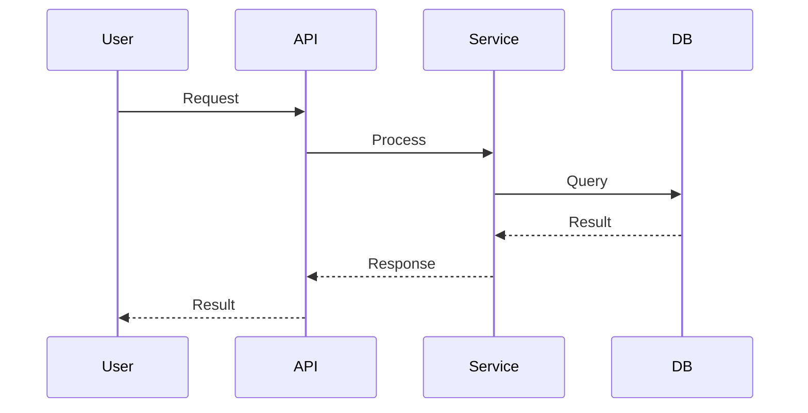
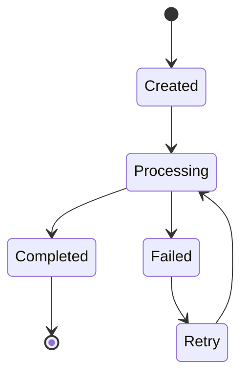

# Design Template

<!-- INSTRUCTIONS: Fill each section based on the approved proposal.md. This document defines HOW the feature will be built. Derive architecture from proposal goals, data model from proposal requirements, API design from proposal success metrics. Reference proposal.md by ID. Each section should be specific enough for tasks.md to break into discrete implementation tasks. -->

> OpenSpec Design - The "How"

## Table of Contents

- [Overview](#1-overview)
- [Architecture](#2-architecture)
- [Data Model](#3-data-model)
- [API Design](#4-api-design)
- [Security](#5-security)
- [Performance](#6-performance)
- [Error Handling](#7-error-handling)
- [Testing Strategy](#8-testing-strategy)
- [Deployment](#9-deployment)
- [Monitoring & Observability](#10-monitoring--observability)
- [Appendix](#appendix)
- [Approval](#approval)

## Feature: [Feature Name]

**Design ID:** DES-[YYYY]-[NNN]
**Proposal:** PROP-[YYYY]-[NNN]
**Status:** Draft | Review | Approved
**Created:** [Date]
**Author:** [Name]

---

## 1. Overview

### Summary
[2-3 sentences describing the technical approach]

### Key Decisions
| Decision | Choice | Rationale |
|----------|--------|-----------|
| [Decision 1] | [Choice] | [Why] |
| [Decision 2] | [Choice] | [Why] |

---

## 2. Architecture

### Sub-Agent Context Firewall
- [ ] Identify tasks requiring heavy context (research, codebase exploration, security scanning)
- [ ] Define which tasks should be delegated to isolated sub-agents
- [ ] Specify return format: summary_only vs full_output
- [ ] Plan context offload strategy (head+tail preservation, filesystem offload)

### System Context
```
┌─────────────────────────────────────────────────────┐
│                    External Systems                  │
├─────────────────────────────────────────────────────┤
│  ┌─────────┐  ┌─────────┐  ┌─────────┐             │
│  │ System A│  │ System B│  │ System C│             │
│  └────┬────┘  └────┬────┘  └────┬────┘             │
└───────┼────────────┼────────────┼───────────────────┘
        │            │            │
        ▼            ▼            ▼
┌─────────────────────────────────────────────────────┐
│                   [FEATURE NAME]                     │
│  ┌─────────────────────────────────────────────┐   │
│  │              Core Component                  │   │
│  │  ┌─────────┐  ┌─────────┐  ┌─────────┐     │   │
│  │  │Module A │  │Module B │  │Module C │     │   │
│  │  └─────────┘  └─────────┘  └─────────┘     │   │
│  └─────────────────────────────────────────────┘   │
└─────────────────────────────────────────────────────┘
```

### Component Diagram
```
┌───────────────────────────────────────────────────┐
│                   Component Layers                 │
├───────────────────────────────────────────────────┤
│  Presentation Layer                                │
│  ┌─────────────────────────────────────────────┐ │
│  │ UI Components / API Endpoints               │ │
│  └─────────────────────────────────────────────┘ │
├───────────────────────────────────────────────────┤
│  Business Logic Layer                             │
│  ┌─────────────────────────────────────────────┐ │
│  │ Services / Domain Logic                     │ │
│  └─────────────────────────────────────────────┘ │
├───────────────────────────────────────────────────┤
│  Data Access Layer                                │
│  ┌─────────────────────────────────────────────┐ │
│  │ Repository / Data Access                    │ │
│  └─────────────────────────────────────────────┘ │
├───────────────────────────────────────────────────┤
│  Infrastructure Layer                             │
│  ┌─────────────────────────────────────────────┐ │
│  │ Database / External Services / Cache        │ │
│  └─────────────────────────────────────────────┘ │
└───────────────────────────────────────────────────┘
```

---

## 3. Data Model

### Entity Relationship
```
┌─────────────┐       ┌─────────────┐       ┌─────────────┐
│   Entity A  │───1:N─│   Entity B  │───N:M─│   Entity C  │
├─────────────┤       ├─────────────┤       ├─────────────┤
│ id: UUID    │       │ id: UUID    │       │ id: UUID    │
│ name: str   │       │ a_id: FK    │       │ name: str   │
│ created_at  │       │ data: json  │       │ config: obj │
└─────────────┘       └─────────────┘       └─────────────┘
```

### Schema Definition
```typescript
// Entity A
interface EntityA {
  id: string;
  name: string;
  createdAt: Date;
}

// Entity B
interface EntityB {
  id: string;
  entityAId: string;
  data: Record<string, unknown>;
}
```

---

## 4. API Design

### Endpoints

| Method | Path | Description | Auth |
|--------|------|-------------|------|
| GET | `/api/v1/resource` | List resources | Required |
| POST | `/api/v1/resource` | Create resource | Required |
| GET | `/api/v1/resource/:id` | Get resource | Required |
| PUT | `/api/v1/resource/:id` | Update resource | Required |
| DELETE | `/api/v1/resource/:id` | Delete resource | Admin |

### Request/Response Examples
```json
// POST /api/v1/resource
// Request
{
  "name": "Example",
  "data": { "key": "value" }
}

// Response
{
  "success": true,
  "data": {
    "id": "uuid-here",
    "name": "Example",
    "createdAt": "2024-01-01T00:00:00Z"
  }
}
```

---

## 5. Security

### Authentication
- [Method: JWT / OAuth2 / Session]
- [Token expiration strategy]
- [Refresh mechanism]

### Authorization
- [RBAC model]
- [Permission structure]

### Data Protection
- [Encryption at rest]
- [Encryption in transit]
- [PII handling]

### Security Checklist
- [ ] Input validation
- [ ] SQL injection prevention
- [ ] XSS prevention
- [ ] CSRF protection
- [ ] Rate limiting
- [ ] Audit logging

---

## 6. Performance

### Requirements
| Metric | Target | Measurement Method |
|--------|--------|-------------------|
| Response Time | < 200ms | APM |
| Throughput | 1000 req/s | Load testing |
| Availability | 99.9% | Uptime monitoring |

### Optimization Strategies
- [Caching strategy]
- [Database indexing]
- [Connection pooling]
- [Async processing]

---

## 7. Error Handling

### Error Codes
| Code | Message | HTTP Status |
|------|---------|-------------|
| E001 | Resource not found | 404 |
| E002 | Validation failed | 400 |
| E003 | Unauthorized | 401 |

### Error Response Format
```json
{
  "success": false,
  "error": {
    "code": "E001",
    "message": "Resource not found",
    "details": {}
  }
}
```

---

## 8. Testing Strategy

### Unit Tests
- [Coverage target: 80%+]
- [Key test scenarios]

### Integration Tests
- [API contract tests]
- [Database integration tests]

### E2E Tests
- [Critical user flows]
- [Happy path + edge cases]

---

## 9. Deployment

### Dependencies
- [Runtime dependencies]
- [Infrastructure dependencies]

### Configuration
```yaml
# Environment variables
FEATURE_ENABLED: true
API_TIMEOUT: 30000
MAX_RETRIES: 3
```

### Rollout Plan
1. [Stage 1: Internal testing]
2. [Stage 2: Beta users]
3. [Stage 3: General availability]

---

## 10. Monitoring & Observability

### Distributed Tracing
- [ ] Define trace span structure (parent/child relationships)
- [ ] Identify LLM calls, tool invocations, and sub-agent calls to trace
- [ ] Enable artifact storage for replay capability

### Token Usage Analytics
- [ ] Track per-request and cumulative token usage
- [ ] Configure doom loop detection (same error threshold: 3)
- [ ] Set token spike alert (2x baseline in 5-minute window)

### Agent Evaluation
- [ ] Configure LLM-as-Judge dimensions (accuracy, helpfulness, safety)
- [ ] Define evaluation thresholds per dimension
- [ ] Schedule periodic human calibration

### Logging
- [Log format]
- [Log levels]
- [Retention policy]

---

## Appendix

### A. Sequence Diagrams


### B. State Machine


---

## Approval

| Role | Name | Status | Date |
|------|------|--------|------|
| Tech Lead | | ⏳ Pending | |
| Security | | ⏳ Pending | |
| Architecture | | ⏳ Pending | |
